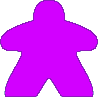

# Table of Contents

1.  [Overview](#org579c551)
2.  [Game Systems](#org88e8145)
    1.  [Class Based Meeple system](#org99280ce)
    2.  [Resource Typings](#org33da497)

# Overview

A competitive city building game set in a zombie apocalypse. Players work to build a stable colony during the most trying of times. Scavenging for materials, building up the colony, fighting off zombies and so much more.

# Game Systems

The game features meeples of various classes used by the players. The classes relate to the core resources which also relate up to various buildings.

<table border="2" cellspacing="0" cellpadding="6" rules="groups" frame="hsides">

<colgroup>
<col  class="org-left" />

<col  class="org-left" />

<col  class="org-left" />

<col  class="org-left" />

<col  class="org-left" />

<col  class="org-left" />
</colgroup>
<thead>
<tr>
<th scope="col" class="org-left">Color</th>
<th scope="col" class="org-left">Class</th>
<th scope="col" class="org-left">type</th>
<th scope="col" class="org-left">Action</th>
<th scope="col" class="org-left">Explore</th>
<th scope="col" class="org-left">Defence</th>
</tr>
</thead>

<tbody>
<tr>
<td class="org-left">Black</td>
<td class="org-left">Scout</td>
<td class="org-left">Wild</td>
<td class="org-left">Scout</td>
<td class="org-left">Redraw upto 2 tokens</td>
<td class="org-left">---</td>
</tr>

<tr>
<td class="org-left">White</td>
<td class="org-left">Scientist</td>
<td class="org-left">Zombies</td>
<td class="org-left">Research</td>
<td class="org-left">---</td>
<td class="org-left">2 zed to cold</td>
</tr>

<tr>
<td class="org-left">Green</td>
<td class="org-left">Soldier</td>
<td class="org-left">Ammo</td>
<td class="org-left">---</td>
<td class="org-left">Kill 1 zed</td>
<td class="org-left">kill 1 zed</td>
</tr>

<tr>
<td class="org-left">Orange</td>
<td class="org-left">Chef</td>
<td class="org-left">Food</td>
<td class="org-left">---</td>
<td class="org-left">+1 food when exploring</td>
<td class="org-left">Feed 2 pop</td>
</tr>

<tr>
<td class="org-left">Red</td>
<td class="org-left">Medic</td>
<td class="org-left">Medicine</td>
<td class="org-left">Tend Wounded</td>
<td class="org-left">---</td>
<td class="org-left">Heal 1 pop</td>
</tr>

<tr>
<td class="org-left">Purple</td>
<td class="org-left">Leader</td>
<td class="org-left">Population</td>
<td class="org-left">recruit+</td>
<td class="org-left">+1 population on deplete</td>
<td class="org-left">---</td>
</tr>

<tr>
<td class="org-left">Blue</td>
<td class="org-left">Engineer</td>
<td class="org-left">Building</td>
<td class="org-left">Construct</td>
<td class="org-left">build</td>
<td class="org-left">---</td>
</tr>
</tbody>
</table>

      

## Resource Typings

The game's resource types come in both a basic and advanced form. The basic use is always available to the advanced resource as though you had 2 resources instead of 1. However some technology and buildings will increase this ratio.

<table border="2" cellspacing="0" cellpadding="6" rules="groups" frame="hsides">

<colgroup>
<col  class="org-left" />

<col  class="org-left" />
</colgroup>
<thead>
<tr>
<th scope="col" class="org-left">Basic Resource</th>
<th scope="col" class="org-left">Use</th>
</tr>
</thead>

<tbody>
<tr>
<td class="org-left">Food</td>
<td class="org-left">Feed 2 population</td>
</tr>

<tr>
<td class="org-left">Medicine</td>
<td class="org-left">Heal 2 population</td>
</tr>

<tr>
<td class="org-left">Ammo</td>
<td class="org-left">Kill 2 Zombies</td>
</tr>

<tr>
<td class="org-left">Zombies (dead)</td>
<td class="org-left">Used in research</td>
</tr>

<tr>
<td class="org-left">Building</td>
<td class="org-left">1 resource per building size</td>
</tr>

<tr>
<td class="org-left">Population</td>
<td class="org-left">Used to activate buildings and fight zombies (No adv. form)</td>
</tr>

<tr>
<td class="org-left">Wild</td>
<td class="org-left">Can be used as Food/Medicine/Ammo/Building resource</td>
</tr>
</tbody>
</table>

     

